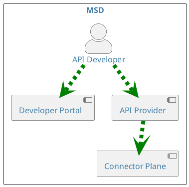
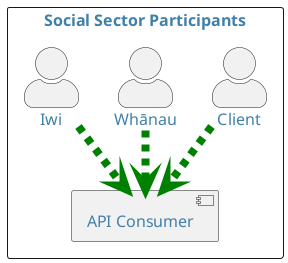
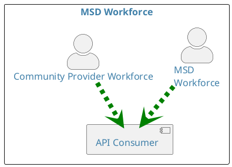
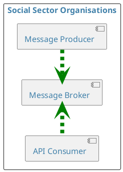

This section provides a list of common API standards components and their associated definitions, adapted for an MSD and social sector context.

## **API Provider**

An API Provider, in the context of these standards, is a software application:

- That produces a REST or Asynchronous API.

- That can be published via the MSD Developer Portal or an equivalent sector capability.

- That has completed an appropriate API Provider onboarding process.

## **API Consumer**

An API Consumer, in the context of these standards, is a software application:

- That consumes a REST, Asynchronous or MCP AP provided by MSD.

- That has completed an approved API Consumer onboarding and certification process.

## **Social Sector Clients and Whānau**

A social sector client, in the context of these standards, is a person interacting — via a software application — with an API Consumer that is consuming an API published on the MSD Developer Portal or equivalent sector capability. This includes individuals accessing income support, employment services, housing assistance or care and protection services, and their whānau.

## **Social Sector Organisations**

A social sector organisation, in the context of these standards, is any organisation that provides or supports social services. This includes government agencies, community and iwi providers, NGOs, and contracted service providers. Participants in these organisations may use a software application that consumes API’s on behalf of a client or whanau.

## **Social Sector Workers**

A social sector worker, in the context of these standards, is any person who provides or supports social services. This includes case managers, employment consultants, social workers, community support workers, and other frontline and back-office MSD and partner-agency staff.

## **API Designers**

An API Designer, in the context of these standards, is a software developer or architect who specialises in designing APIs. API designers work to create APIs that are easy to use, efficient and secure, and typically have a strong understanding of software development principles as well as a good working knowledge of the business context they're designing for.

## **API Developers**

An API Developer, in the context of these standards, is a software engineer who designs, builds and maintains APIs — the sets of rules that allow different software applications to communicate with each other. API developers create APIs that let other developers access data and functionality without needing to know the underlying implementation.

## **Application Developers**

An Application Developer, in the context of these standards, is a software engineer who designs, develops, tests and deploys software applications, typically specialising in a particular type of development such as mobile, web or enterprise software.

| Characteristic | API Developer | Application Developer |
| --- | --- | --- |
| Primary focus | Developing APIs | Developing software applications |
| Audience | Other developers | Social sector workers, clients and whānau |
| Example tasks | Design and develop new APIs; maintain and update existing APIs; create API documentation | Gather and analyse user requirements; design and develop software applications; write and test code; debug and fix defects; deploy and maintain applications |

## **Message Producer**

A Message Producer, in the context of these standards, is a software application that publishes data to API Consumers using Asynchronous APIs — for example, publishing an event when a client's case status changes.

## **How these components relate**

At a social sector organisation, an API Developer builds and operates an API Provider; an Application Developer builds and operates an API Consumer. The API Developer works through the MSD Developer Portal to publish their API, which is then discoverable and consumable by Application Developers across MSD and its delivery partners.

Social sector clients, whānau, iwi and community providers interact with API Consumers — the applications built on top of MSD's published APIs — rather than with the underlying APIs directly. A Message Producer at a social sector organisation publishes data (for example, a change of circumstances event) to a message broker, which is then consumed by one or more API Consumers.

## Relationship Diagrams

```plantuml alt="Diagram showing API interactions within Social Sector organisations"
@startuml

skinparam {
    defaultFontColor #4080a9
    defaultBackgroundColor #d7f8ff
    defaultComponentColour #61d9de
    defaultActorColour #61d9de
    defaultFontSize 16
    defaultArrowThickness 6
    actorStyle awesome
    linetype polyline
}

rectangle "Social Sector Organisations" {
    component "API Consumer" as AC
    component "API Provider"  as AP
    actor "Application Developer" as APPD
    actor "API Developer" as APID
    APPD .[#green,dashed,thickness=8].> AC
    APID .[#green,dashed,thickness=8].> AP
}
@enduml
```

<DetailedDescription text="This shows the relationships between actors in social sector organisations. An API Developer at a Social Sector Organisation is an API Provider, and an Application Developer is an API consumer." />



<DetailedDescription text="The diagram explains that the API Developer interacts with the Developer Portal to access the API Provider. The API Provider communicates with the Connector Plane to facilitate the API Developer's requests." />



<DetailedDescription text="The diagram illustrates the relationships and flows between various participants in the social sector. The Client, Whānau, and Iwi actors represent individuals and groups who interact with the social sector. The API Consumer component represents a system that collects data from these actors." />



<DetailedDescription text="The MSD Workforce API Consumption diagram illustrates the relationships and flows between the MSD Workforce and Community Provider Workforce actors, who both interact with the API Consumer." />



<DetailedDescription text="This shows the relationships between actors in social sector organisations. A Message Producer at a Social Sector Organisation publishes data to the Message Broker, to be consumed by an API Consumer." />
