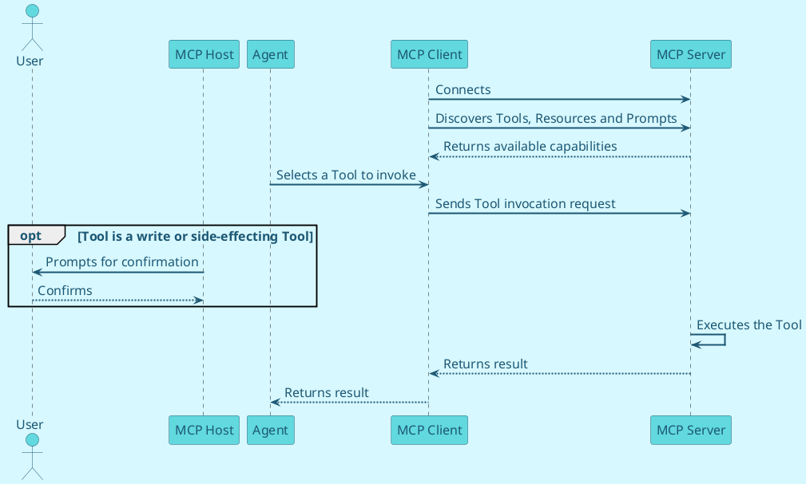

MCP Servers (see Part C, MCP APIs) don't have a static specification artefact in the way OpenAPI and AsyncAPI provide for REST and event-driven APIs — an MCP Client discovers a Server's Tools, Resources and Prompts dynamically at connection time, rather than reading a specification document in advance. This doesn't remove the obligation to document the Server for the people building on it.

## **Capability catalogue**

<Standard id="MSDAS_MUST_API_PROVIDERS_MCP_SERVER_PUBLISH_2" type="MUST">
API Providers of an MCP Server MUST publish a capability catalogue — a human-readable listing of available Tools, Resources and Prompts, each with its purpose, required scopes, and any side effects (particularly for Tools that write data or trigger real-world actions) — via the MSD Developer Portal, in addition to the protocol's own machine-readable discovery.
</Standard>

The catalogue serves the same purpose for MCP that an OpenAPI specification serves for a REST API: it lets a prospective integrator or reviewer understand what the Server can do, and what it would mean to grant an agent access to it, without needing to connect a live Client first.

## **Existing publishing components still apply**

The remaining Publishing Components set out earlier in this Part apply equally to MCP Servers as to REST and Asynchronous APIs:

- Business Context — what business outcome the Server's capabilities support, and for whom.

- Diagrams — a sequence diagram showing a typical agent interaction is particularly valuable for MCP, since the flow (discovery, tool selection, invocation, confirmation) is less familiar to reviewers than a REST request/response.

- Terms and Conditions and Developer Onboarding — including any additional attestations required before an MCP Client is authorised to connect, given the broader autonomy an agent has relative to a conventional application.

- Service Level Agreements — published as for any other API Provider.

## **Example sequence diagram**

<DetailedDescription text="This sequence diagram shows an MCP Client connecting to an MCP Server and discovering its available Tools, Resources and Prompts. The agent selects a Tool to invoke, and if that Tool is a write or side-effecting Tool, the Host prompts the user for confirmation before the Server executes it and returns a result." />
