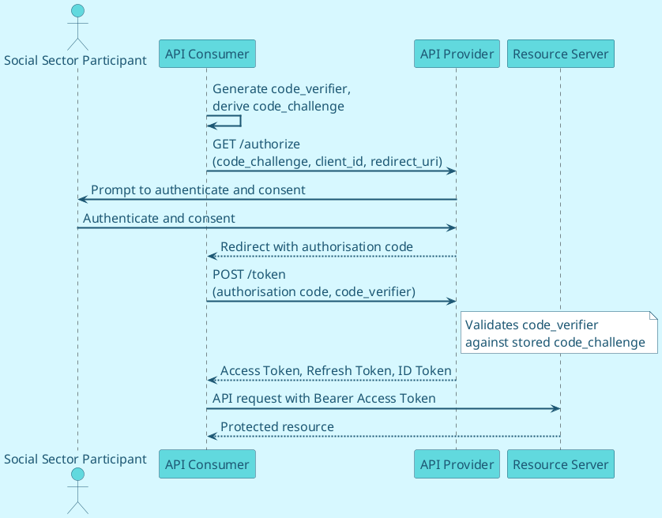
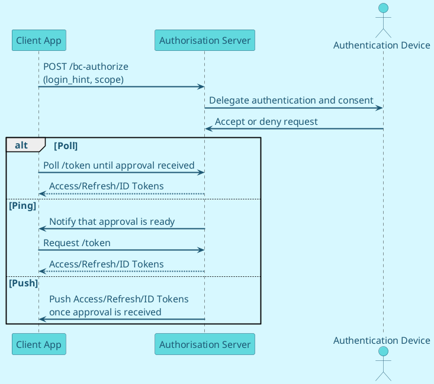

OAuth 2.0 and OpenID Connect are both token-based authorisation frameworks, defined and implemented using grant flow patterns. These define the different types of interaction a client application can perform to gain an access token, and thus access to a protected API.

## **Token types**

| Token type | Description | Requirement |
| --- | --- | --- |
| Authorisation Code | Sent to the API Consumer after the resource owner has authenticated and consented; exchanged with the API Provider for an Access Token. | Must be protected with TLS; must be encrypted when stored; must not be stored once used. |
| Access Token (Bearer) | Returned to the API Consumer and sent to the resource server when requesting a protected resource. | Must be protected with TLS; must be encrypted when stored; should have a lifetime under 60 minutes. |
| Refresh Token | Used to obtain a new Access Token (and possibly a new Refresh Token) once the Access Token has expired. | Must be protected with TLS; must be encrypted when stored; if used in single-page applications, must have a lifetime of 24 hours or less. |
| ID Token | A signed JWT used in OpenID Connect flows, containing metadata used to enhance the security of the token exchange. | Must be used as a detached signature; must be signed with an approved algorithm. |
| API Key | A string used in some scenarios to authenticate the client application to the API. | Should be a 40+ character random string; should have an associated rotation policy (e.g. 6–12 month lifecycle). |

## **Token formats**

| Format | Where used | Recommendation |
| --- | --- | --- |
| Opaque | Authorisation Code, Access Token, Refresh Token | A random, unique string with no embedded user information, mapped by the OAuth 2.0 server to stored information. May be used with UNCLASSIFIED or IN-CONFIDENCE data; if supported, must be used together with the token issuer's /tokeninfo endpoint. |
| JWT | Access Token, Refresh Token, ID Token | Self-contained, storing identity and access information as claims. May be used with UNCLASSIFIED or IN-CONFIDENCE data. |
| JWE (encrypted JWT) | Access Token, Refresh Token, ID Token | A JWT encrypted per RFC 7516. May be used with UNCLASSIFIED or IN-CONFIDENCE data; must be used where the token itself contains sensitive information or personal data. |

A JWT is made up of three sections separated by a period: a header (token type, signing algorithm, key identifier), a payload (including claims such as subject, issuer, audience, scope and expiry), and a signature used to validate the token. JWTs are preferred where possible because they support client-side introspection without a call back to the authorisation server, carry identity and expiry claims that support fine-grained access control, are digitally signed to prevent tampering, follow a standard cross-vendor format, and can be encrypted where they contain personal information.

## **OAuth 2.0 and OpenID Connect endpoints**

Depending on the grant flow in use, some or all of the following endpoints are exposed by the API Provider.

| Endpoint | Purpose | Key requirements |
| --- | --- | --- |
| /authorize | Redirects the resource owner to the authentication server to log in and consent to the client accessing a protected resource. | Must be protected with TLS; the API Consumer must have registered and been allocated a client ID; PKCE must be used for authorisation code flows; PAR and JARM may be used. |
| /token | Authenticates the API Consumer and, subject to validation, issues Access/Refresh/ID Tokens. | Should be protected with mTLS; proof of possession should be used; client_secret_post, client_secret_jwt, private_key_jwt or tls_client_auth should be applied. |
| Redirect endpoint | Receives the response from the authorisation endpoint via HTTP redirect (302). | Must be protected with TLS; PKCE must be used for authorisation code flows; redirect URI validation must be carried out; state and nonce parameters must be included. |
| /revoke | Lets the API Consumer revoke tokens. | Must be provided by the API Provider; must be protected with TLS. |
| /introspect | Lets the resource server or client check whether a token has expired and retrieve other token details. | Should be provided by the API Provider; must be protected with TLS. |
| /userinfo | Uses an access token to retrieve information about the authenticated social sector participant. | Should be provided by the API Provider; must be protected with TLS; the access token used must be validated for validity, issuer and signature. |
| /jwks | Retrieves the API Provider's public keys, used to verify issued token signatures and encrypt ID Tokens. | Must be implemented by the API Provider; is a public endpoint and must be protected with TLS. |
| /par | Pushed Authorisation Request endpoint (see PAR, JARM and Session Management, below). | May be used. |
| /bc-authorize | Client-Initiated Backchannel Authentication (CIBA) endpoint for decoupled authentication. | May be used. |
| /register | Lets relying parties register a client on the authorisation server. | — |
| /.well-known/openid-configuration | Returns the API Provider's OAuth 2.0/OIDC configuration and capabilities, including endpoints, algorithms and grant types. | — |

<Standard id="MSDAS_MUST_DOCUMENT_CONSUMER_ONBOARDING_PROCESS" type="MUST">
API Providers must document their API Consumer onboarding process and the requirements a prospective consumer has to meet.
</Standard>

## **OpenID Connect**

OpenID Connect adds two capabilities on top of OAuth 2.0: an ID Token, and a Userinfo endpoint. It's invoked using the openid request scope in the initial authorisation call.

<Standard id="MSDAS_MUST_USE_OPENID_CONNECT_FOR_INTERACTIVE_SENSITIVE_APIS" type="MUST">
OpenID Connect MUST be used wherever an individual — a client, whānau member, MSD staff member, or a delivery partner's staff member — is directly authenticating through the consuming application and the API is acting on that individual's behalf
</Standard>

<Standard id="MSDAS_MUST_NOT_USE_OPENID_CONNECT_AS_RISK_ASSESSMENT" type="MUST NOT">
OpenID Connect MUST NOT be treated as a substitute for a genuine data-sharing risk assessment in system-to-system integrations where no individual is directly authenticating
</Standard>

### **ID Token**

<Standard id="MSDAS_MUST_USE_ID_TOKEN_FOR_SENSITIVE_APIS" type="MUST">
The ID Token must be used with all APIs exposing IN-CONFIDENCE or more sensitive information.
</Standard>

The ID Token is a JWT containing authenticated user information provided by the OpenID Connect server to the API Consumer. It may be used to enforce finer-grained access controls via additional claims; must be signed by an approved algorithm; should include claims that hash the code, state and access token to protect user integrity; may carry additional non-identity metadata (e.g. session details); must have its issuer, audience, nonce and expiry validated by the API Consumer; and may be encrypted.

<Standard id="MSDAS_MUST_MINIMISE_IDENTITY_ATTRIBUTES" type="MUST">
API Providers must ensure only the minimum number of identity attributes needed to meet the API Consumer's request are provided.
</Standard>

<Standard id="MSDAS_MUST_NOT_PUT_SENSITIVE_INFORMATION_IN_AUTHORISE_ENDPOINT_ID_TOKENS" type="MUST NOT">
An ID Token returned from the authorise endpoint must not contain personal or highly sensitive client information.
</Standard>

ID Tokens are returned either from the authorise endpoint over TLS, or from the token endpoint over mTLS.

### **Interaction patterns and identity requirements**

The correct authentication and authorisation model depends on *who or what is actually authenticating*, not on the sensitivity of the data alone. The table below sets out the three patterns APIs are expected to encounter.

| Interaction pattern | Description | Requirement |
| --- | --- | --- | --- |
| Individual present | A client, whānau member, MSD staff member, or a delivery partner's staff member authenticates directly and the API acts on their behalf. | | OpenID Connect MUST be used — ID Token, consent, and an appropriate Level of Assurance MUST all apply, regardless of information classification. |
| System-to-system (B2B) | A partner's backend system calls an MSD API under its own authority, with no individual authenticating as part of the flow (e.g. nightly reconciliation, batch data sync). | The Client Credentials grant MUST be used, with strong client authentication and scopes limited to exactly what the integration needs. OpenID Connect MUST NOT be required, since there's no individual subject for an ID Token to represent. |
| Delegated / acting-on-behalf-of | A partner's *system* acts on behalf of an identifiable individual at that partner (e.g. a caseworker at a delivery partner organisation), without that individual authenticating directly to MSD. | Client Credentials MUST be used for the system-to-system leg, and the calling system MUST include a claim identifying the individual it's acting on behalf of  so MSD retains individual-level accountability for the access, even though that individual never authenticates to MSD directly. The azp (authorised party) claim (see Level of Assurance) supports the System-to-system and Delegated patterns by identifying which registered client is calling, independent of any individual claims that may or may not also be present. |

### **Userinfo endpoint and scopes**

The Userinfo endpoint may be exposed by the API Provider, callable with an access token to obtain the same claims provided in the ID Token, or configured to provide additional claims. OpenID Connect introduces additional scopes (e.g. profile, name, email) detailing specific attributes that can be presented in an ID Token.

<Standard id="MSDAS_MUST_OBTAIN_CONSENT_TO_SHARE_ATTRIBUTES" type="MUST">
Before releasing identity attributes through the ID Token or the Userinfo endpoint, the API Provider must ensure consent to share those attributes has been given by the information owner — typically the client or their authorised representative — and must record any consent and its associated parameters.
</Standard>

## **Grant types**

OAuth 2.0 and OpenID Connect support two client types — Confidential and Public — and eleven grant/response types, each suited to different situations.

<Standard id="MSDAS_MUST_LIMIT_GRANT_TYPES" type="MUST">
The API Provider must limit grant types to those agreed and documented for a given API; the API Consumer indicates its desired grant type via the response_type parameter in its initial authorisation call.
</Standard>

Confidential clients are websites and services that make secure server-side connections to the OAuth 2.0 server, and can securely store a client secret or JWT; they must be used to secure IN-CONFIDENCE APIs. Public clients — single-page applications, applications running on devices, and applications that cannot protect secrets — may only be used for UNCLASSIFIED APIs.

| Grant / response type | Recommendation |
| --- | --- |
| Authorisation Code (OAuth 2.0) | May be used for Confidential Clients; must not be used for Public Clients. |
| Authorisation Code (OIDC) with PKCE | May be used for UNCLASSIFIED APIs, with Native or Single Page Applications. Where a SPA or mobile app lacks a secure Backend for Frontend, PKCE prevents malicious interception of the authorisation code. |
| Hybrid (OIDC) code id_token token | Should not be used. |
| Hybrid (OIDC) code id_token | Must be used with IN-CONFIDENCE APIs, with a web application (confidential client). |
| Hybrid (OIDC) code token | Should not be used. |
| Implicit (OAuth 2.0) | Should not be used. |
| Implicit (OIDC) id_token token, with PKCE | Should not be used. |
| Implicit (OIDC) id_token | Should not be used. |
| Resource Owner Password Credential | Must not be used. |
| Client Credentials | Should only be used for system-to-system integration; supports confidential clients only. |

### **Authorisation Code Flow with PKCE**

<Standard id="MSDAS_MUST_USE_AUTHORISATION_CODE_FLOW_WITH_PKCE" type="MUST">
The OIDC Authorisation Code flow (code id_token) with PKCE must be used when securing IN-CONFIDENCE APIs, together with JWT access and refresh tokens.
</Standard>

This is the most frequently used, and most secure, model for public-facing consumer applications, and can also be used for internal APIs. It's a two-step process: the resource owner authenticates to the API Provider and authorises the API Consumer over TLS; the API Consumer receives a temporary authorisation code; and the API Consumer exchanges that code for an access (and refresh) token over a secure back channel, which may use mTLS.

<DetailedDescription text="This shows the Authorisation Code Flow with PKCE — the API Consumer generates a code_verifier and code_challenge, the Social Sector Participant authenticates and consents at the API Provider, and the API Consumer then exchanges the returned authorisation code and code_verifier for tokens before calling the Resource Server with the access token." />

### **PKCE**

<Standard id="MSDAS_MUST_USE_PKCE_FOR_CONFIDENCE_APIS" type="MUST">
PKCE must be used when securing IN-CONFIDENCE APIs.
</Standard>

PKCE (Proof Key for Code Exchange) mitigates man-in-the-middle attacks against the authorisation code flow. The API Consumer creates a random code verifier, applies a hash to produce a code challenge, and sends the code challenge (with hash method) to the API Provider, which stores it. When the API Consumer later exchanges the authorisation code for a token, it includes the original code verifier; the API Provider validates this against the stored code challenge before issuing the access token — confirming the token request came from the original client, not an intercepting party.

For confidential clients using the code flow with PKCE, the refresh token is exchanged over a secure server-side backchannel. For public clients (native or mobile applications), MSD should not use the refresh token flow, since the refresh token would otherwise have to be managed in the browser.

### **Client Credentials**

The Client Credentials flow should be used for server-to-server integration — for a client that is also the resource owner, needing to access its own data rather than acting on behalf of a client or whānau member (for example, a batch job updating its own configuration). It supports confidential clients only: the client authenticates directly to the /token endpoint with its own credentials and receives an access token without any user interaction, then uses that token to call the resource server, which validates it with the authorisation server on each call. It is recommended for the Authorised Consuming Application pattern (device to API) and for server-to-server (B2B) integration using signed tokens without user interaction.

### **Client Initiated Backchannel Authentication (CIBA)**

CIBA adds a “decoupled” authorisation flow: rather than redirecting through a browser, a client or whānau member's authentication device (e.g. their phone) is decoupled from the client application and used to perform authentication and consent independently — the client application and authorisation service don't need to run on, or be linked to, the same device.

In CIBA, the initial authorisation call goes to the backchannel authentication endpoint (/bc-authorize); the authorisation server then delegates authentication and consent to the user's authentication device, which accepts or denies the request. The resulting token can be delivered to the client via one of three sub-flows: Poll (the client polls the authorisation server until approval is received), Ping (the client waits to be notified, then requests the token), or Push (the authorisation server pushes the tokens to the client once approval is received).

<DetailedDescription text="This shows the CIBA flow — the Client App calls /bc-authorize, the Authorisation Server delegates authentication and consent to the user's Authentication Device, and the resulting tokens are delivered via one of the Poll, Ping or Push sub-flows." />

<Standard type="INFO">
CIBA is not yet widely used, and is included here as forward guidance. It's likely to become more common — it's already used in the Payments NZ API Centre Standards — and MSD should watch for adoption in other parts of the NZ public and financial sectors as a signal for when to invest in it.
</Standard>
